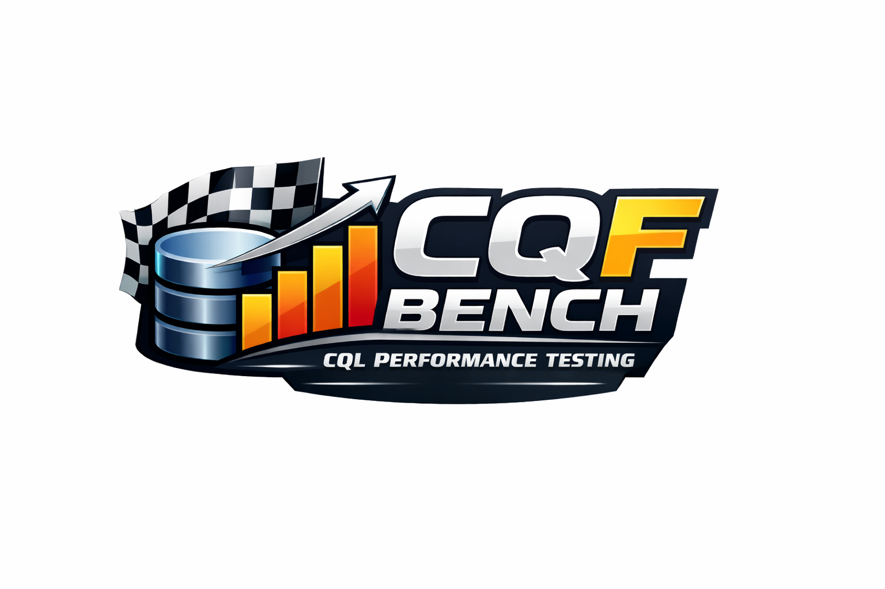

  

# cqf-bench

Open benchmark harness for comparing CQF / Clinical Reasoning endpoint behavior and performance across engines.

- **Docs site:** [carreraGroup.github.io/cqf-bench](https://carreraGroup.github.io/cqf-bench/)

> **Status: Early preview.** CQF Bench is a transparent benchmark harness, not a
> certification program. The scenario catalog, adapter contract, and report format
> are usable but still evolving. Results should be interpreted as reproducible
> benchmark evidence, not certification, regulatory validation, or vendor endorsement.

All included benchmark data is synthetic/generated for test use and is **not**
derived from real patient, customer, or production data.

## Choose Your Path

| I want to... | Start here |
|---|---|
| Run CQF Bench locally with HAPI CQF Ruler | [GETTING_STARTED.md](GETTING_STARTED.md) |
| Add my own CQF / Clinical Reasoning engine | [Add an Engine](docs-site/src/content/docs/guides/add-an-engine.md) |
| Compare multiple engines | [Compare Engines](docs-site/src/content/docs/guides/compare-engines.md) |
| Understand benchmark scenarios | [catalog.md](catalog.md) |
| Interpret reports | [Output Format](docs-site/src/content/docs/reference/output-format.md) |
| See an example report | [examples/reports/](examples/reports/) |
| Contribute a scenario | [CONTRIBUTING.md](CONTRIBUTING.md) |

## Start Here

Use [GETTING_STARTED.md](GETTING_STARTED.md) for a minimal setup and run flow:

1. Stand up CQF Ruler (OSS)
2. Bootstrap Python environment
3. Run generate -> load -> execute

## What This Repository Contains

- `CONF###` scenarios: endpoint conformance checks (untimed)
- `CAP###-P` scenarios: capability/performance with preloaded data
- `CAP###-I` scenarios: capability/performance with inline data

Core files and scripts:

- `bench/scenarios/tpcqf/suite.yaml`
- `bench/scenarios/tpcqf/<SCENARIO_ID>/`
- `bench/config/engines.example.yaml`
- `scripts/run_benchmark.py`
- `scripts/generate_scenario_data.py`
- `scripts/load_test_data.py`
- `scripts/execute_tests.py`
- `scripts/manage_engines.py`
- `scripts/bootstrap_python_env.sh`

## Local Configuration Policy

- Use tracked example files as templates:
  - `bench/config/engines.example.yaml` -> `bench/config/local.engines.yaml`
  - `docker-compose.override.yml.example` -> `docker-compose.override.yml`
- Keep local values in local files only.
- `bench/config/local.engines.yaml` and `docker-compose.override.yml` are gitignored.
- Localhost endpoints in example files are intentional and supported for local development.

## Config Files

| File | Tracked | Purpose |
|---|---|---|
| `bench/config/engines.example.yaml` | Yes | Template engine config with localhost-friendly defaults. |
| `bench/config/local.engines.yaml` | No (gitignored) | Local engine config used for actual runs. |
| `docker-compose.override.yml.example` | Yes | Template Docker override with placeholders only. |
| `docker-compose.override.yml` | No (gitignored) | Local Docker override with environment-specific values. |

## Reporting

For each engine, report tables show three columns per scenario:

- `Result` — one of:
  - `PASS` — executed and returned the expected result
  - `FAIL` — executed but incorrect, errored, timed out, or returned a warning status
  - `UNSUPPORTED` — the engine does not support the capability the scenario requires
  - `NOT_RUN` — scenario was not executed for this engine (filtered or skipped); **not** a correctness failure
- `Time` (blank unless `PASS`)
- `Note` (includes correctness-failure reason, endpoint used, and HTTP status)

CAP timing is only counted for correctness-valid (`PASS`) responses, so performance
is never compared across incorrect or unsupported responses.

`scripts/execute_tests.py` defaults to `--runs 5` and passes this to the runner as repeated scenario executions for averaged timing.

## Current Scope and Limitations

CQF Bench is ready to use as an **open benchmark harness and scenario suite**,
but it should be released with a clear understanding of current scope:

- The harness is designed for **transparent, reproducible comparative testing**,
  not certification.
- Included example workflows are strongest today for **correctness,
  conformance behavior, and controlled small-scale performance runs**.
- Large-scale benchmark campaigns (for example `1k+`, `10k+`, hardware matrix
  studies, and crash-threshold characterization) are valid next steps, but are
  **not claimed as completed by this repository alone**.
- Results should always be described with context such as workload scale,
  engine version, hardware profile, Docker limits, and run methodology.

This framing helps readers distinguish between:

- the **benchmark tool** being public and usable now, and
- broader **scalability claims** that require additional benchmark campaigns.

## Candidate / Example Engine Targets

These are possible benchmark targets or adapter examples. Inclusion does **not**
imply vendor endorsement, official support, certification, or published benchmark
results. HAPI CQF Ruler is the public reference engine and the default runnable
path; the others require a private image, a reachable remote endpoint, or an
adapter that is not yet turnkey (see `bench/config/engines.example.yaml`).

- HAPI CQF Ruler (public reference / default)
- Blaze FHIR
- Mercury (requires a private local image)
- Firely-based runtimes (commercial engine)
- Smile CDR (commercial engine)
- LinuxForHealth FHIR

## Maintainers

- **Angelo Kastroulis** ([@angelok1](https://github.com/angelok1)) —
  [akastroulis@carrera.io](mailto:akastroulis@carrera.io)

For security issues, see [SECURITY.md](SECURITY.md) (email the maintainer).

## Additional Documentation

- **[Documentation site](https://carreraGroup.github.io/cqf-bench/)** — guides, concepts, and reference (source in [`docs-site/`](docs-site/))
- [GETTING_STARTED.md](GETTING_STARTED.md)
- [catalog.md](catalog.md)
- [BENCHMARK_TESTS.md](BENCHMARK_TESTS.md)
- [CONTRIBUTING.md](CONTRIBUTING.md)
- [Branch protection setup](.github/BRANCH_PROTECTION.md) (maintainers: enforce PR + CI)
- [SECURITY.md](SECURITY.md)
- [CODE_OF_CONDUCT.md](CODE_OF_CONDUCT.md)

## License

Apache-2.0. See [LICENSE](LICENSE) and [NOTICE](NOTICE).
