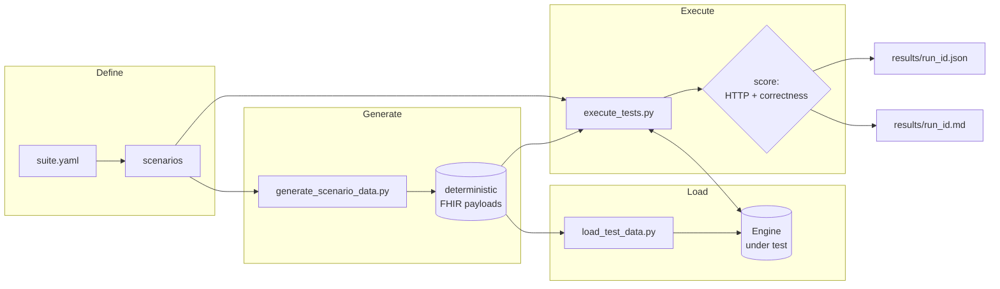
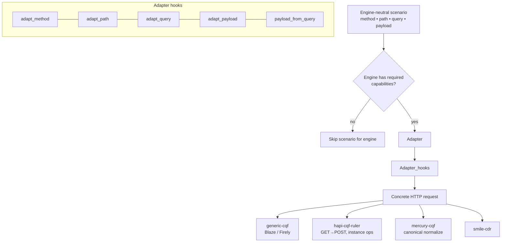
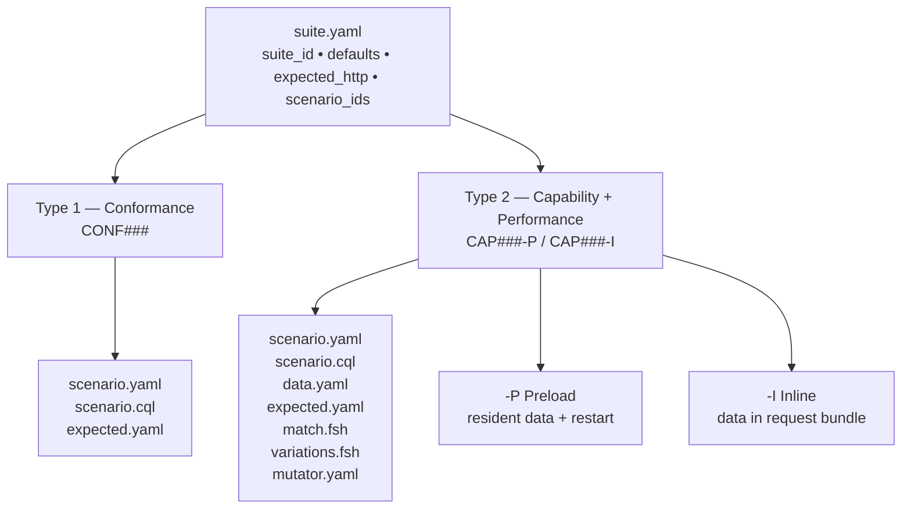
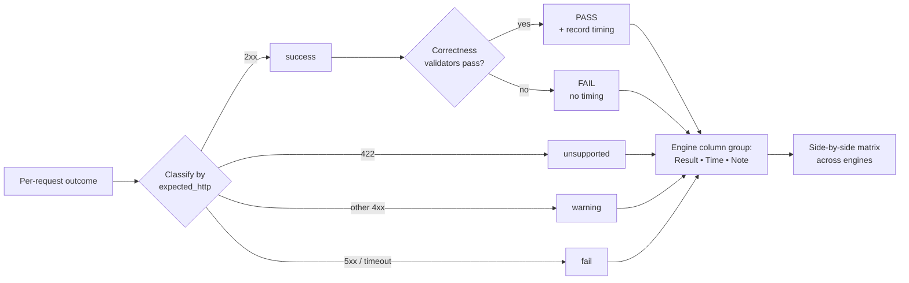

This page collects diagram sketches that explain CQF Bench visually. Each one is
provided as a short description plus a [Mermaid](https://mermaid.js.org/) source
block you can render later or redraw as a static SVG.

:::note[Rendering Mermaid]
Starlight does not render Mermaid out of the box. To turn the code blocks below
into diagrams, add a Mermaid integration (for example the `starlight-mermaid`
plugin, or a `rehype-mermaid` setup) to `docs/astro.config.mjs`. Until then, the
blocks render as readable source — which is intentional for a first draft.
:::

## 1. CQF Bench workflow

**What it shows:** the end-to-end path from suite definition to reports, through
the generate → load → execute phases, with the engine under test on the right.

## 2. Engine adapter architecture

**What it shows:** a single engine-neutral scenario is translated by a per-engine
adapter into the concrete request each server expects. Capabilities gate
eligibility; adapters translate the request.

## 3. Benchmark suite structure

**What it shows:** how a suite decomposes into the two scenario classes and the
files each scenario folder contains.

## 4. Result comparison flow

**What it shows:** how per-request outcomes roll up into the side-by-side matrices,
emphasizing that timing only flows from PASS rows.

## Redrawing as static SVG

If you prefer committed SVGs over runtime rendering:

1. Render each Mermaid block (e.g. with the Mermaid CLI `mmdc` or the live
   editor) to `docs/src/assets/diagrams/<name>.svg`.
2. Reference them from Markdown: ``.
3. Keep the Mermaid source on this page as the editable source of truth.
